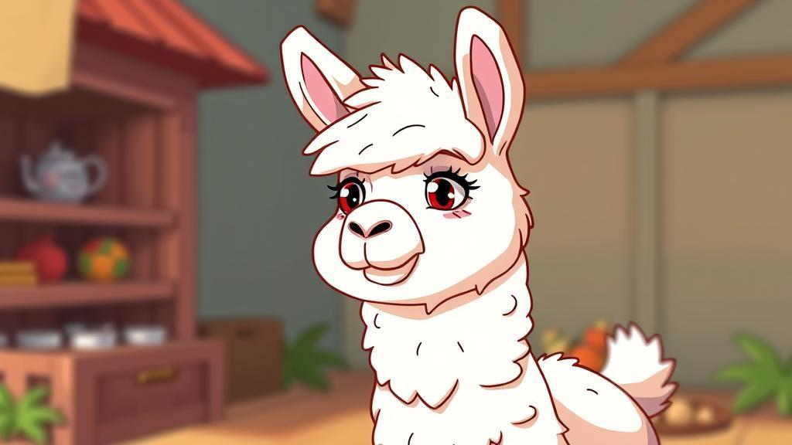

# Noah

|Model|Tokenizer|PT|SFT|
|:-:|:-:|:-:|:-:|
|Noah-0.04B|[Github](https://github.com/KnowAIHub/Noah/tree/main/model/tokenizer_6400)|[HuggingFace](https://huggingface.co/wangrongsheng/Noah-0.04B-Base)|[HuggingFace](https://huggingface.co/wangrongsheng/Noah-0.04B-Chat)|
|Noah-0.1B|[Github](https://github.com/KnowAIHub/Noah/tree/main/model/tokenizer_6400)|[ModelScope](https://modelscope.cn/models/wangrongsheng/Noah-0.1B-Chat/files)|[ModelScope](https://modelscope.cn/models/wangrongsheng/Noah-0.1B-Chat/)|
|Noah-MoE-0.09B|[Github](https://github.com/KnowAIHub/Noah/tree/main/model/tokenizer_6400)|[ModelScope](https://modelscope.cn/models/wangrongsheng/Noah-MoE-0.09B-Chat/files)|[ModelScope](https://modelscope.cn/models/wangrongsheng/Noah-MoE-0.09B-Chat/)|

# References

1. https://github.com/jiahe7ay/MINI_LLM
2. https://github.com/jingyaogong/minimind
3. https://github.com/DLLXW/baby-llama2-chinese
4. https://github.com/charent/ChatLM-mini-Chinese
5. https://github.com/wdndev/tiny-llm-zh
6. https://github.com/Tongjilibo/build_MiniLLM_from_scratch
7. https://github.com/jzhang38/TinyLlama
8. https://github.com/AI-Study-Han/Zero-Chatgpt
9. https://github.com/loubnabnl/nanotron-smol-cluster ([使用Cosmopedia训练cosmo-1b](https://huggingface.co/blog/zh/cosmopedia))
10. https://github.com/charent/Phi2-mini-Chinese
11. https://github.com/allenai/OLMo
12. https://github.com/keeeeenw/MicroLlama
13. https://github.com/Chinese-Tiny-LLM/Chinese-Tiny-LLM
14. https://github.com/leeguandong/MiniLLaMA3
15. https://github.com/Pints-AI/1.5-Pints
16. https://github.com/zhanshijinwat/Steel-LLM
